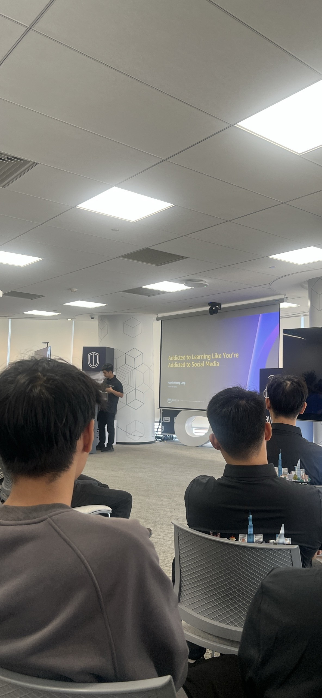

# Summary Report: “Weekend Knowledge Sharing Session”

### Event Objectives

- Encourage continuous learning and self-development in the technology field.
- Explore practical AI techniques that improve software development productivity.
- Introduce AI-assisted software development methodologies and modern development workflows.
- Provide career guidance and essential mindsets for students preparing to enter the technology job market.

### Speakers

- **Huynh Hoang Long** – Addicted to Learning Like You're Addicted to Social Media
- **Thịnh Nguyễn** – Automated Prompt Engineering: Enhancing LLM Output Quality
- **Khang Nguyễn** – Career Opportunities & Mindset for Entering the Job Market
- **Thao Nguyen Phuong** – BMAD Method – AI-Driven Development Workflow
### Key Highlights

#### Addicted to Learning Like You're Addicted to Social Media

- Building a learning habit that is as consistent as using social media every day.
- Creating a sustainable learning system instead of learning only when required.
- Developing curiosity and continuously exploring new technologies.
- Practical tips for maintaining motivation and improving long-term learning effectiveness.

#### Automated Prompt Engineering: Enhancing LLM Output Quality

- Introduction to a personal project on Automated Prompt Engineering.
- Improving LLM output quality through automated prompt optimization.
- Reducing manual prompt refinement while increasing response consistency.
- Practical applications of automated prompt engineering in AI development.

#### Career Opportunities & Mindset for Entering the Job Market
- Current trends and opportunities in the technology job market.
- Essential technical and soft skills for students preparing to enter the workforce.
- Importance of problem-solving, teamwork, communication, and continuous learning.
- Building a strong portfolio and gaining practical project experience

#### BMAD Method – AI-Driven Development Workflow

- Introduction to the BMAD Method for AI-assisted software development.
- AI agents supporting different stages of the software development lifecycle.
- AI-assisted requirement analysis, planning, implementation, and testing.
- Open-source BMAD Method repository as a practical learning resource.

### Key Takeaways

#### Personal Development
- **Continuous learning** should become a daily habit rather than a temporary goal.
- Building a structured learning system leads to long-term professional growth.
- Staying curious helps developers adapt to rapidly changing technologies.

#### AI Development

- **Prompt Engineering** Ais essential for improving LLM response quality.
- Automated prompt optimization increases development productivity.
- AI can support multiple phases of the software development lifecycle beyond code generation.
#### Career Preparation

- Employers value both technical expertise and soft skills.
- Real-world projects and a strong portfolio significantly improve employability.
- A growth mindset and continuous self-improvement create long-term career advantages.

### Development Workflow

- AI-assisted development frameworks help improve software development efficiency.
- Integrating AI into planning, implementation, and testing streamlines project delivery.
- Open-source methodologies provide valuable references for modern software development.

### Applying to Work

- Build a structured learning routine and continuously update technical knowledge.
- Apply Prompt Engineering techniques to improve AI-powered applications.
- Explore the BMAD Method and AI-assisted software development workflows.
- Continue developing practical projects to strengthen technical skills and build a professional portfolio.
- Improve communication, teamwork, and problem-solving skills alongside technical competencies.

#### Event Experience
- Attending the Weekend Knowledge Sharing Session was highly valuable, providing practical insights into continuous learning, AI-assisted software development, and career preparation. The event combined personal experiences, technical knowledge, and professional guidance that can be directly applied to future projects and career development.

#### Learning from industry experts
- Speakers shared practical experiences in continuous learning, AI development, and career preparation.
- Real-world examples demonstrated how AI and effective learning habits contribute to long-term professional growth.

#### Hands-on technical exposure
- Learned how Automated Prompt Engineering improves the quality and consistency of LLM outputs.
- Explored AI-assisted software development workflows through the BMAD Method.
- Understood how AI can support software development from planning to implementation and testing.

#### Leveraging modern tools
- Discovered the BMAD Method as an AI-driven software development framework.
- Learned practical approaches to integrating AI into everyday development workflows.
- Explored open-source resources that support AI-assisted software engineering.

#### Networking and discussions
- The sharing sessions provided opportunities to exchange ideas with experienced developers and AI practitioners.
- Career discussions offered practical advice on preparing for employment and building long-term professional growth.
- The event emphasized the importance of combining technical skills with continuous learning and personal development.

#### Lessons learned
- Continuous learning is one of the most important factors for long-term success in the technology industry.
- AI is becoming an essential partner throughout the software development lifecycle.
- Prompt Engineering and AI-assisted workflows can significantly improve software development - productivity.
- Strong technical skills, practical experience, and the right mindset are equally important for career success.

#### Some event photos

> Overall, "The Weekend Knowledge Sharing Session" provided valuable insights into continuous learning, AI-assisted software development, and career preparation. Through practical sharing from experienced speakers, I gained new perspectives on effective learning habits, AI development workflows, and the skills and mindset needed to grow in the technology industry. Overall, the event was both informative and inspiring, encouraging continuous self-improvement and the practical adoption of AI in software development.
